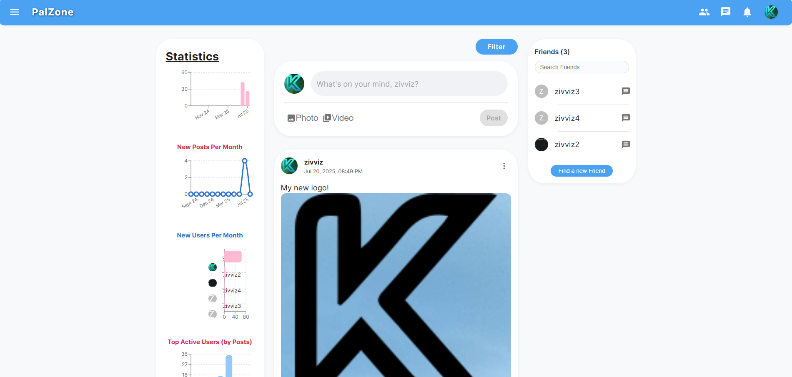
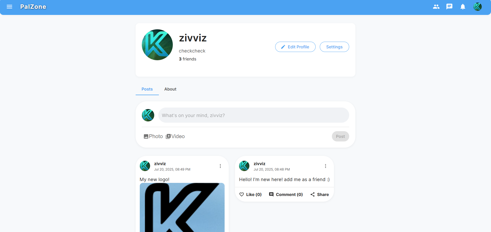
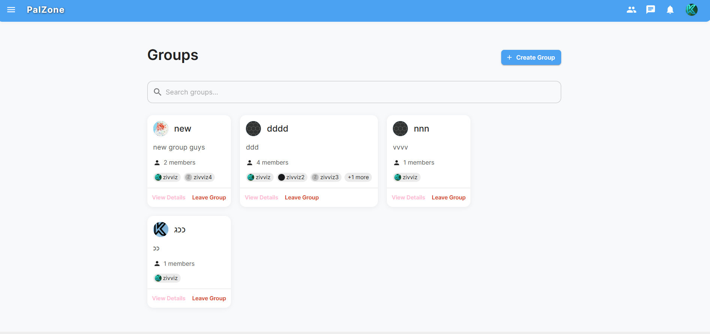
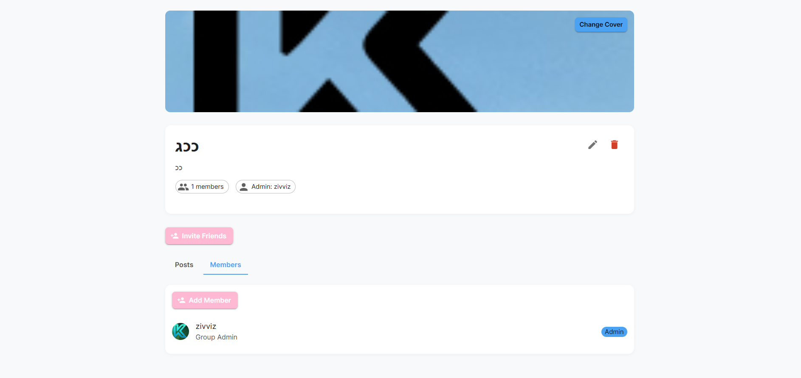
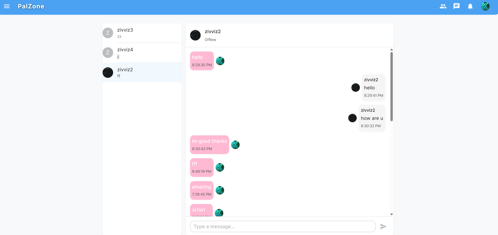
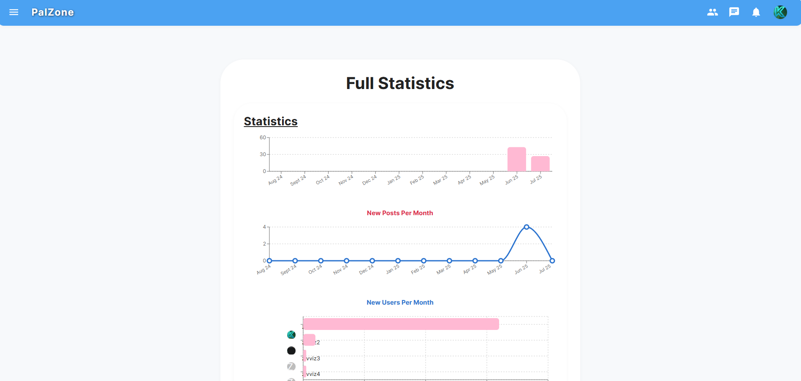

# PalZone

PalZone is a full-stack social network platform that enables users to connect, share, and communicate in real time. This MVP delivers the essential features of a modern social network, including posts, groups, friends, chat, and statistics, with a responsive and intuitive UI.

---

## 🚀 Project Overview
PalZone is a social networking web application built with React (frontend) and Node.js/Express/MongoDB (backend). It supports user authentication, posting, commenting, groups, direct messaging, and analytics.

---

## ✨ Features

- **User Authentication**: Register, login, logout, JWT-based auth, user profiles.
- **Feed & Posts**: Home feed, create/edit/delete posts (text, image, video), like, comment, filter posts.
- **Groups**: Browse, search, join, create, and manage groups (public/private), group feeds, group admin tools.
- **Friends & Social Graph**: Send/accept/reject friend requests, view friends list.
- **Direct Messaging**: Real-time chat with friends, online status, Socket.io-powered.
- **Statistics**: View analytics and activity graphs.
- **Modern UI/UX**: Material UI, responsive design, sidebar navigation.

---

## 🛠️ Tech Stack

- **Frontend**: React, React Router, Material UI, React Query, Socket.io-client
- **Backend**: Node.js, Express, MongoDB (Mongoose), Socket.io, JWT, Multer
- **Other**: D3/Recharts (statistics), dotenv, CORS, 

---

## 🏁 Step-by-Step Setup Guide

### 1. Prerequisites
- **Node.js** (v16+ recommended): [Download & Install Node.js](https://nodejs.org/)
- **npm** (comes with Node.js)
- **MongoDB** (local or cloud):
  - **Local:** [Download & Install MongoDB Community Server](https://www.mongodb.com/try/download/community)
  - **Cloud:** [Sign up for MongoDB Atlas](https://www.mongodb.com/cloud/atlas)

### 2. Clone the Repository
```bash
git clone https://github.com/yourusername/effisocial.git
cd effisocial
```

### 3. Install Dependencies
- **Backend:**
  ```bash
  cd server
  npm install
  ```
- **Frontend:**
  ```bash
  cd ../client
  npm install
  ```

### 4. Configure Environment Variables

#### Backend (.env in `server/`)
Create a `.env` file in the `server` directory with the following content:
```env
# MongoDB connection string (local or Atlas)
MONGODB_URI=mongodb://localhost:27017/effisocial

# JWT secret and expiration
JWT_SECRET=your_jwt_secret_here
JWT_EXPIRE=7d

# CORS origin for frontend
CLIENT_URL=http://localhost:3000

# Server port (optional)
PORT=5000

# Node environment (optional)
NODE_ENV=development
```
- If using MongoDB Atlas, replace `MONGODB_URI` with your Atlas connection string.
- Set a strong value for `JWT_SECRET`.

#### Frontend (.env in `client/` - optional)
If you want to change the backend API URL, create a `.env` file in the `client` directory:
```env
REACT_APP_API_URL=http://localhost:5000/api
```

### 5. Start MongoDB
- **Local:**
  - If installed locally, start MongoDB with:
    ```bash
    mongod
    ```
  - Or use MongoDB Compass or your OS service manager.
- **Cloud:**
  - No action needed; just ensure your Atlas cluster is running and your URI is correct.

### 6. Run the App
- **Backend:**
  ```bash
  cd server
  npm run dev
  ```
- **Frontend:**
  ```bash
  cd ../client
  npm start
  ```

### 7. Open in Browser
Visit [http://localhost:3000](http://localhost:3000)

---

## 📁 Folder Structure

```
SocialNetwork/
  client/      # React frontend
  server/      # Node.js/Express backend
```

- `client/` - React app (UI, components, pages, hooks, context)
- `server/` - Express API, models, controllers, routes, real-time (Socket.io)

---

## 🖼️ Screenshots

Here are some screenshots of PalZone in action:

| Home Page | Profile Page |
|-----------|-------------|
|  |  |

| Groups List | Group Details |
|-------------|---------------|
|  |  |

| Chat | Statistics |
|------|------------|
|  |  |

---

## 🙌 Contributing

Pull requests are welcome! For major changes, please open an issue first to discuss what you would like to change.

---

## 📣 Acknowledgements

- [React](https://react.dev/)
- [Material UI](https://mui.com/)
- [Express](https://expressjs.com/)
- [MongoDB](https://www.mongodb.com/)
- [Socket.io](https://socket.io/) 
